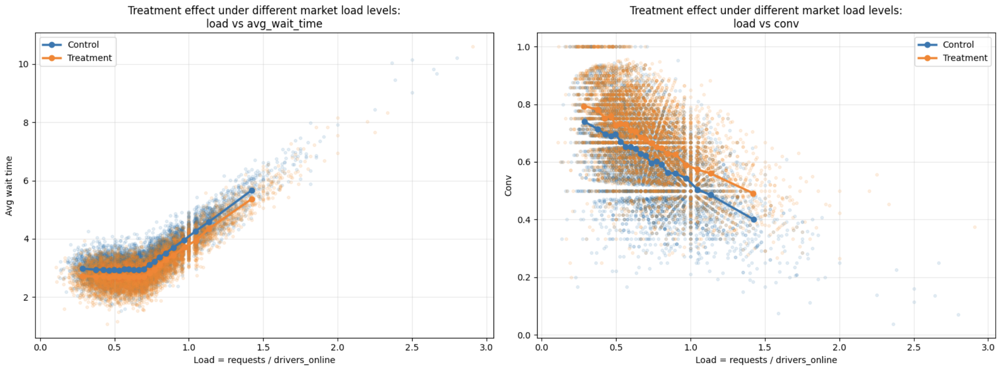

# Two-Sided Marketplace Synthetic Data Generator

This repository contains one Jupyter notebook:

```text
two_sided_market_generator.ipynb
```

The notebook implements a synthetic data generator for a two-sided marketplace and demonstrates how to analyze switchback-style A/B experiments.

The generated dataset represents marketplace activity aggregated by:

```text
city × time window
```

Each row corresponds to one city during one time window and contains demand, supply, matching, waiting time, treatment assignment, and derived marketplace metrics.

## Motivation

Two-sided marketplaces often have strong interference between users, supply, and demand. For this reason, classic user-level A/B testing may be inappropriate.

Instead, marketplace experiments often use switchback randomization, where treatment is assigned to a whole marketplace unit for a fixed time window.

In this notebook, the randomization unit is:

```text
city × window_start
```

This setup allows us to simulate and analyze treatment effects under realistic marketplace dynamics.

## Generated data

The generator creates synthetic marketplace data with:

- demand seasonality by hour of day
- weekday/weekend effects
- city-level demand and supply differences
- sticky supply dynamics
- market load effects
- switchback treatment assignment
- carryover from previous treatment windows
- treatment effects on matching efficiency and wait time

## Key metrics

| Metric | What it measures | Type | Comment |
|---|---|---|---|
| `completed` | Absolute number of successful matches/trips | Marketplace throughput | ok |
| `conv` | Matching efficiency | Marketplace efficiency | Ratio metric |
| `avg_wait_time` | Service quality / latency | User experience | Heavy-tailed metric |

## Main illustration

The figure below shows how treatment effect depends on market load.

Treatment is expected to be more visible when the marketplace is under pressure, i.e. when demand is high relative to available supply.

```text
load = requests / drivers_online
```



The left plot shows that treatment reduces average wait time under higher load.  
The right plot shows that treatment improves conversion under higher load.

This is an example of heterogeneous treatment effect: the effect is not constant across all marketplace states.

## A/B testing setup

The basic experiment compares treatment and control groups using the switchback assignment:

```text
treat = 0 → control
treat = 1 → treatment
```

A simple baseline analysis can use a Welch t-test on `completed`:

```python
ttest_ind(completed_control, completed_treatment, equal_var=False)
```

## Ratio metric testing

The metric `conv` is a ratio metric:

```text
conv = completed / requests
```

Testing ratio metrics requires care. A naive t-test on row-level `conv` may be noisy or biased because different windows have different numbers of requests.

### 1. Linearization

First, estimate the baseline conversion rate from the control group:

```python
kappa = completed_control.sum() / requests_control.sum()
```

Then construct a linearized metric:

```python
conv_linearized = completed - kappa * requests
```

After that, standard methods such as t-test or regression can be applied to the linearized metric.

### 2. Delta method

Another common approach is to use a t-test together with the delta method variance approximation.

The delta method estimates the variance of the ratio metric while accounting for variability in both:
- numerator (`completed`)
- denominator (`requests`)

### Practical recommendation

For marketplace experiments, a common practical workflow is:

```text
linearization + Welch t-test
```

or:

```text
delta method + Welch t-test
```

## CUPED / variance reduction

CUPED can be used if we have a prepilot period before the pilot period.

The general idea is:

1. Split the data into prepilot and pilot periods.
2. Build covariates using only the prepilot period.
3. Use these covariates to reduce the variance of the pilot-period target metric.

Possible prepilot covariates:

| Target metric | Possible CUPED covariates |
|---|---|
| `completed` | `completed_pre`, `requests_pre`, `drivers_online_pre` |
| `conv` | `conv_pre`, `completed_pre`, `requests_pre` |
| `avg_wait_time` | `avg_wait_time_pre`, `load_pre`, `requests_pre`, `drivers_online_pre` |

Important requirements:

- covariates must be measured before treatment starts
- covariates must not be affected by treatment
- covariates should be correlated with the target metric

For ratio metrics such as `conv`, CUPED can be applied either to:
- the linearized ratio metric
- or carefully constructed preperiod ratio covariates

A practical approach is:

```text
linearize conv first, then apply CUPED
```
